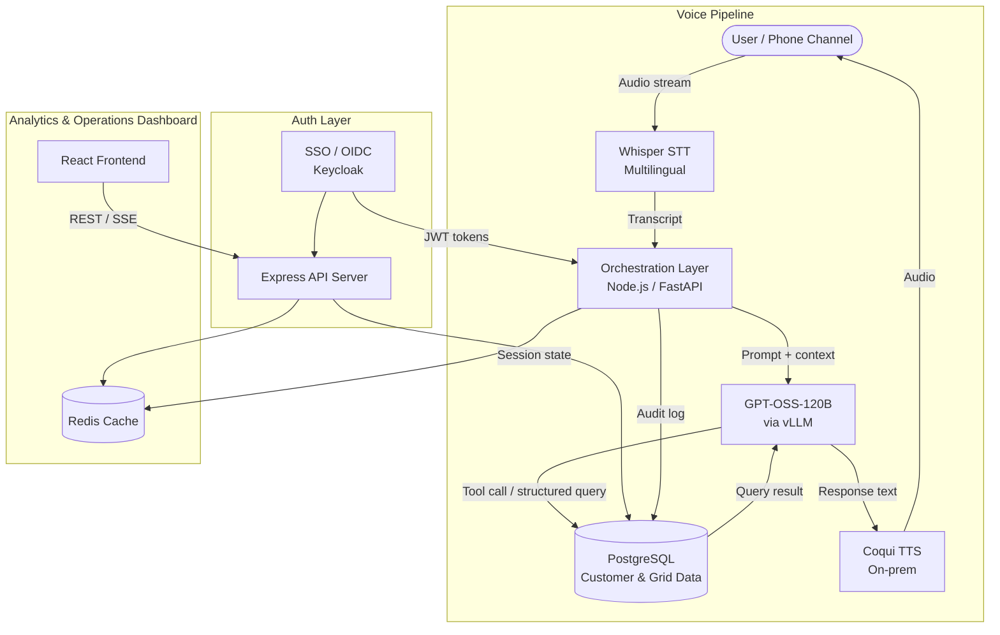
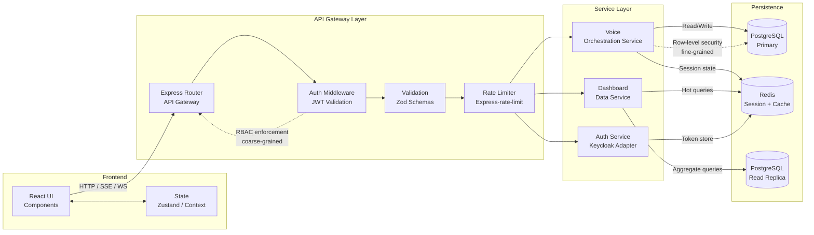
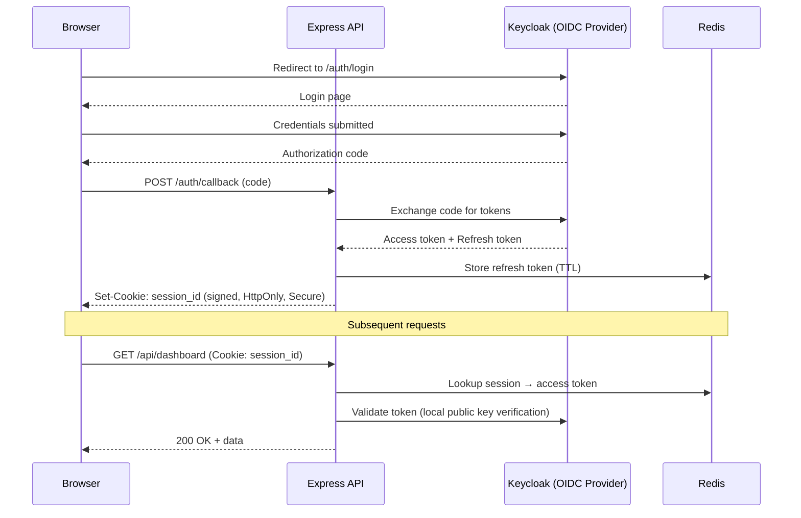
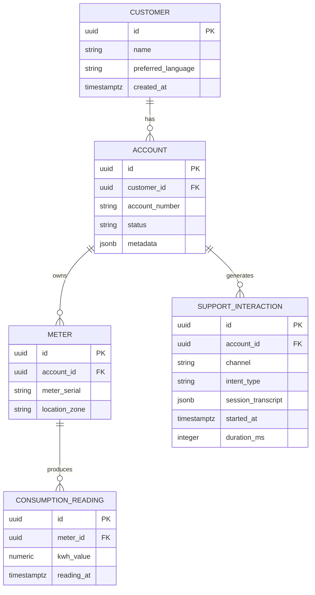

# conversational-ai-utility-assistant-design

An architectural design study for a self-hosted, multilingual conversational AI assistant in the energy utility domain.


---

> **Disclaimer:** This repository is a personal design study and independent architectural
> exploration. All content is based on publicly available documentation and my own analysis
> of how such a system could be designed. It does not represent any deployed system.

---

## Table of Contents

1. [Motivation](#motivation)
2. [Problem Framing](#problem-framing)
3. [Design Goals](#design-goals)
4. [Proposed Architecture](#proposed-architecture)
5. [Technology Survey](#technology-survey)
6. [API & Orchestration Layer](#api--orchestration-layer)
7. [Authentication & Authorization Architecture](#authentication--authorization-architecture)
8. [Data Model & Persistence](#data-model--persistence)
9. [Latency Budget](#latency-budget)
10. [Generic Design Challenges](#generic-design-challenges)
11. [Frontend Architecture](#frontend-architecture)
12. [Dashboard Layer (Conceptual)](#dashboard-layer-conceptual)
13. [Security & Deployment Considerations](#security--deployment-considerations)
14. [What I Learned](#what-i-learned)
15. [Open Questions / Future Exploration](#open-questions--future-exploration)
16. [References](#references)
17. [License](#license)

---

## Motivation

I wanted to understand how one would design a production-grade, on-prem conversational AI
system for a regulated, data-sensitive industry. The energy utility sector is a compelling
case study because it combines voice and text interfaces, structured data lookup,
multilingual users, and strict data residency requirements.

Unlike consumer applications where latency tolerances are generous and cloud APIs are
acceptable, a utility-facing assistant has to work within hard operational constraints —
call center SLAs, regional language diversity, regulatory compliance around customer data,
and the expectation that a voice interaction resolves quickly enough to feel natural.
Designing for all of these simultaneously, on infrastructure the operator controls
end-to-end, is a genuinely difficult systems problem.

As I dug deeper, I realized the AI pipeline is only half the challenge. The other half
is the full-stack infrastructure surrounding it: the API layer that orchestrates calls
between services, the auth system that enforces role-based access across multiple operator
personas, the data model that must serve both real-time transactional queries and
aggregate analytics, and the dashboard frontend that makes the system useful for
operations teams who never interact with the conversational interface at all.

This document is my attempt to reason through the complete design from first principles,
using publicly available tools and research as building blocks.

---

## Problem Framing

The following observations are based on publicly available industry reports and research,
not internal operational data:

- **High call volumes for routine queries.** Utilities globally receive significant inbound
  call traffic for tasks like outage reporting, billing inquiries, and meter readings.
  According to McKinsey's analysis of utility customer service operations, a large fraction
  of these interactions are highly repetitive and pattern-predictable — a natural target
  for automation.
  ([McKinsey: Utilities & Customer Experience](https://www.mckinsey.com/industries/electric-power-and-natural-gas/our-insights))

- **Multilingual customer support is operationally expensive.** In markets with significant
  linguistic diversity — such as India, parts of Southeast Asia, and the United States —
  utilities must staff separate language queues or rely on interpretation services.
  This multiplies cost without meaningfully improving first-call resolution rates.

- **Data residency rules in many regions preclude cloud LLM APIs.** Regulations such as
  India's DPDP Act, the EU's GDPR, and various sector-specific data localization mandates
  mean that routing customer query content through commercial cloud-hosted LLM APIs
  may not be legally permissible without extensive legal review. Self-hosted inference
  is the path of least regulatory risk.
  ([DPDP Act overview](https://www.meity.gov.in/data-protection-framework))

- **Existing IVR systems are rigid and frustrating for users.** Traditional interactive
  voice response systems require navigation through fixed menu trees. Research consistently
  shows high IVR abandonment rates and low user satisfaction. A natural language interface
  that handles open-ended queries would represent a significant usability improvement —
  if latency and accuracy targets can be met.

---

## Design Goals

A system designed for this context would need to optimize for:

| Goal | Rationale |
|---|---|
| **Sub-5-second voice round-trip latency** | Voice interactions feel natural below ~4s; above that, users assume the system has failed |
| **On-premise deployment** | Data residency and regulatory compliance in regulated utility markets |
| **Multilingual support (English + Indic languages)** | Serve linguistically diverse customer bases without separate infrastructure per language |
| **Grounded responses** | LLMs must retrieve factual data from structured sources rather than generating plausible-sounding but incorrect answers |
| **Role-based access for operations teams** | Different personas (field ops, billing, compliance) need scoped access to backend data |
| **Containerized, reproducible deployment** | Infrastructure-as-code principles; no snowflake servers; easy horizontal scaling |

---

## Proposed Architecture

> **Note:** Both diagrams below are design proposals, not descriptions of any running system.

### Voice Pipeline Overview



### Full-Stack Request Flow (Detailed)



The gateway layer handles cross-cutting concerns (auth, validation, rate limiting) before
any request reaches a service. The service layer implements business logic, with the
voice orchestration service managing the AI pipeline and the dashboard data service
handling operational analytics. Persistence is split: the primary PostgreSQL instance
handles transactional writes; a read replica serves the higher-volume dashboard queries;
Redis handles session state and hot caches for both.

---

## Technology Survey

### GPT-OSS-120B (Open-Weight LLM)

[gpt-oss-120b](https://openai.com/index/introducing-gpt-oss/) is OpenAI's open-weight
reasoning model, released in August 2025 under the Apache 2.0 license. It is a
Mixture-of-Experts (MoE) model with 117B total parameters and 5.1B active parameters
per token, designed to fit on a single 80GB GPU (e.g., NVIDIA H100) when served with
MXFP4 quantization. It supports a 128K context window, strong instruction following,
and native tool-use / function-calling capabilities.

For this design, gpt-oss-120b is attractive because it is genuinely open-weight (no
API dependency), commercially permissive (Apache 2.0), strong on agentic and reasoning
tasks, and has a small enough hardware footprint to be realistic for on-prem deployment
by a single utility operator. Comparable open-weight alternatives in the same class
include LLaMA 3.1 70B/405B, Mistral Large, and Falcon 180B — the architecture described
here would work with any of them, with adjustments to GPU footprint and prompt
engineering.

- [OpenAI: Introducing gpt-oss](https://openai.com/index/introducing-gpt-oss/)
- [gpt-oss-120b on Hugging Face](https://huggingface.co/openai/gpt-oss-120b)
- [gpt-oss Model Card (arXiv:2508.10925)](https://arxiv.org/abs/2508.10925)
- [Meta LLaMA 3 Technical Report](https://ai.meta.com/research/publications/meta-llama-3/) (comparable alternative)

### vLLM

[vLLM](https://github.com/vllm-project/vllm) is an open-source LLM serving framework
developed at UC Berkeley. Its core innovation — **PagedAttention** — manages GPU KV-cache
memory in pages rather than pre-allocated contiguous blocks, dramatically increasing
throughput for concurrent requests. It exposes an OpenAI-compatible REST API, simplifying
integration with existing tooling.

- [vLLM Paper: PagedAttention (Kwon et al., 2023)](https://arxiv.org/abs/2309.06180)
- [vLLM GitHub](https://github.com/vllm-project/vllm) · [vLLM Docs](https://docs.vllm.ai/)

### Whisper (Speech-to-Text)

[OpenAI Whisper](https://github.com/openai/whisper) is trained on 680,000 hours of
multilingual audio and supports 99 languages including Hindi, Tamil, Telugu, and Bengali.
`faster-whisper` (CTranslate2-optimized) enables production-grade throughput on GPU.

- [Whisper Paper (Radford et al., 2022)](https://arxiv.org/abs/2212.04356)
- [faster-whisper GitHub](https://github.com/SYSTRAN/faster-whisper)

### Coqui TTS

[Coqui TTS](https://github.com/coqui-ai/TTS) is a self-hostable TTS library supporting
VITS, XTTS, and other architectures across multiple languages. It produces natural-sounding
audio without routing through a cloud API.

- [Coqui TTS GitHub](https://github.com/coqui-ai/TTS)
- [VITS Paper (Kim et al., 2021)](https://arxiv.org/abs/2106.06103)

### PostgreSQL + Node.js + Express + Redis

PostgreSQL provides ACID transactions, row-level security, JSON columns, and strong
indexing — suitable for both transactional utility data and audit logging. Node.js/Express
handles the API layer with JSON-native tooling and a mature middleware ecosystem. Redis
serves as the session store and hot cache, where sub-millisecond lookup times matter for
session validation on every request.

- [PostgreSQL Docs](https://www.postgresql.org/docs/)
- [Express Docs](https://expressjs.com/en/4x/api.html)
- [Redis Docs](https://redis.io/docs/)

### React + Tailwind CSS

React's component model, combined with Tailwind CSS's utility-first approach, would allow
a dashboard UI to be built rapidly with design consistency across panels and personas.
Tailwind eliminates the overhead of CSS-in-JS at runtime while keeping styles colocated
with markup.

- [React Docs](https://react.dev/) · [Tailwind CSS Docs](https://tailwindcss.com/docs)

### Docker

Docker enables reproducible, infrastructure-agnostic deployment. Each service runs in
its own container with declared dependencies, making horizontal scaling, version rollback,
and environment parity tractable on-prem.

- [Docker Docs](https://docs.docker.com/)
- [NVIDIA Container Toolkit](https://docs.nvidia.com/datacenter/cloud-native/container-toolkit/overview.html)

---

## API & Orchestration Layer

The orchestration layer is arguably the most load-bearing component in this architecture.
It is the integration point between the voice pipeline, the LLM, the structured data
layer, and the dashboard — and most of the actual engineering complexity lives here, not
in the model.

### Protocol Choices: REST vs WebSocket vs SSE

Different communication patterns would be appropriate for different client interactions:

| Client Interaction | Protocol | Rationale |
|---|---|---|
| Dashboard data queries | REST (HTTP/JSON) | Stateless, cacheable, well-supported by CDNs and proxies |
| Voice response streaming | WebSocket or SSE | Server-push model; avoid polling for audio chunk delivery |
| Live operational metrics | SSE | One-directional push from server; simpler than WebSocket when the client doesn't send data |
| LLM response streaming | SSE | Token-by-token streaming maps naturally to chunked SSE events |

Server-Sent Events are often underused in favor of WebSockets, but for many dashboard
use cases (live metrics, status feeds) SSE is simpler to implement, proxy-friendly, and
auto-reconnects natively. The
[MDN SSE documentation](https://developer.mozilla.org/en-US/docs/Web/API/Server-sent_events)
covers the protocol in detail.

### Session State Management

Voice conversations are stateful — the system must remember which account the user
authenticated as, what query type is in progress, and what data has already been
retrieved, across multiple turns of dialogue. A practical session design would combine:

- **In-memory store** for active sessions (fast, zero-latency for the common case)
- **Redis-backed persistence** for durability and multi-instance sharing (TTL-evicted,
  preventing unbounded memory growth)
- A session ID carried in a signed cookie or request header, never exposed raw

Redis's `SETEX` command (set with expiry) is the natural primitive for TTL-based session
eviction. [Redis documentation on key expiry](https://redis.io/docs/manual/keyspace-notifications/).

### Request Validation and Schema Enforcement

Every API boundary is an opportunity for malformed data to propagate into the system.
[Zod](https://zod.dev/) (TypeScript-first) or [Joi](https://joi.dev/) would provide
runtime schema validation at the Express layer, with structured error responses that
give clients enough context to self-correct without leaking internal implementation
details.

A consistent error envelope — `{ error: { code, message, field? } }` — makes client-side
error handling predictable. Stripe's
[API design principles](https://stripe.com/blog/payment-api-design) document this
approach well, and the [OpenAPI Specification](https://swagger.io/specification/) is a
natural format for documenting the API contract.

### Rate Limiting and Circuit Breaker Patterns for LLM Calls

LLM calls differ from typical API calls in two ways: they are expensive (GPU compute,
seconds of wall time) and their failure modes are unusual (a valid HTTP 200 with a
malformed or incomplete response). Two patterns matter here:

1. **Rate limiting per session/user:** Prevents a single misbehaving client from
   monopolizing GPU resources. `express-rate-limit` with a Redis store handles this
   across multiple Node instances.

2. **Circuit breaker for the vLLM service:** If the LLM service is overloaded or
   unavailable, requests should fail fast rather than queuing indefinitely. The circuit
   breaker pattern (documented in
   [Martin Fowler's write-up](https://martinfowler.com/bliki/CircuitBreaker.html))
   opens the circuit after N consecutive failures and re-probes after a cooldown period.

### LLM Tool Call Dispatch

When the LLM decides to call a tool (e.g., `get_account_balance(account_id: "ACC-123")`),
the orchestrator acts as the executor:

```
1. Receive tool call JSON from LLM response stream
2. Validate tool name against registered tool registry
3. Validate parameters against tool schema (Zod)
4. Execute: query PostgreSQL with parameterized SQL
5. Serialize result back to LLM context
6. Continue generation — LLM verbalizes the result
```

This dispatch loop is what prevents hallucination on factual data: the LLM cannot invent
a balance because it must call the tool and receive the real value. The
[OpenAI function calling documentation](https://platform.openai.com/docs/guides/function-calling)
covers the protocol; the same pattern works with open-weight models fine-tuned for tool
use.

---

## Authentication & Authorization Architecture

### OIDC Login Flow

A self-hosted OIDC provider (e.g., Keycloak) would handle identity. The flow from
browser login to API access could look like this:



JWT access tokens are short-lived (15–30 minutes). Refresh tokens are stored server-side
in Redis (never sent to the client beyond the session cookie), which enables
server-initiated revocation — critical for regulated environments where account
termination must take immediate effect.

### Role Hierarchy Design

An operations platform serving multiple teams would define a role hierarchy. A possible
design:

| Role | Accessible Data |
|---|---|
| `ops_field` | Outage events, meter status, geographic assignments |
| `ops_billing` | Customer accounts, billing cycles, payment records |
| `ops_compliance` | Audit logs, full read-only access, no write access |
| `it_admin` | System configuration, user management, all data |

Roles are issued as JWT claims by the OIDC provider (`realm_access.roles` in Keycloak).
The API gateway enforces coarse-grained access (does this role have access to this
endpoint?). The service layer enforces fine-grained access (does this role have access
to this specific record?). PostgreSQL row-level security provides a third enforcement
layer as defense-in-depth.

### Where Authorization Is Enforced

```
API Gateway (Express middleware)
  └── Coarse-grained: Is this role allowed to call /api/billing/** at all?
      Service Layer (business logic)
        └── Fine-grained: Can this user access account ID X? (ownership checks)
            PostgreSQL (row-level security policies)
              └── Defense-in-depth: SQL returns only rows the session role may see
```

[OWASP Authentication Cheat Sheet](https://cheatsheetseries.owasp.org/cheatsheets/Authentication_Cheat_Sheet.html)
and the [OAuth 2.0 RFC 6749](https://datatracker.ietf.org/doc/html/rfc6749) are the
primary references for the auth protocol design.
[Keycloak documentation](https://www.keycloak.org/documentation) covers the OIDC
provider configuration in detail.

### Audit Logging Tied to Identity

Every data access event — not just mutations — should write to an audit log with:
`user_id`, `role`, `action_type`, `resource_type`, `resource_id`, `timestamp`, `ip_address`.

In PostgreSQL, this can be implemented as an append-only table with a write-only role
(the application can INSERT but not UPDATE or DELETE audit rows). This creates a tamper-
evident trail suitable for compliance review.

---

## Data Model & Persistence

### Domain Entities (Conceptual)

At a conceptual level, a utility operational system would model entities roughly like this:



These entities are illustrative of the general shape of utility domain data, informed by
publicly documented data models such as the
[IEC Common Information Model (CIM)](https://www.iec.ch/cim) standard.

### Normalization Tradeoffs

**Transactional path (voice pipeline):** 3NF normalization is appropriate — accounts,
meters, and readings are separate tables with foreign keys. This minimizes write
amplification and keeps the schema clean for single-record lookups (the most common
voice query pattern).

**Analytical path (dashboards):** Aggregate queries over normalized tables are slow.
Options include:
- **Materialized views** that pre-aggregate common dashboard queries, refreshed on a
  schedule or via triggers
- **Denormalized reporting tables** populated by an ETL job from the normalized source
- A separate analytical database (discussed further in Open Questions)

### Time-Series Considerations

Consumption readings are a time-series dataset that grows continuously. In PostgreSQL,
[declarative table partitioning](https://www.postgresql.org/docs/current/ddl-partitioning.html)
by `reading_at` (e.g., monthly partitions) keeps query plans efficient and enables
partition-level archival. A `BRIN` index on the timestamp column is space-efficient for
naturally ordered time-series data.

### JSON Columns for Flexible Fields

`jsonb` columns (e.g., `SUPPORT_INTERACTION.session_transcript`, `ACCOUNT.metadata`)
allow schema evolution without migrations for fields that are read infrequently or whose
shape is not yet stable. PostgreSQL's `jsonb` supports GIN indexing for fast key-level
queries within JSON documents.

### Row-Level Security

PostgreSQL's
[row-level security (RLS)](https://www.postgresql.org/docs/current/ddl-rowsecurity.html)
allows policies to be attached to tables that filter results based on the current session
role. A `billing_analyst` role could be restricted to rows in `ACCOUNT` where
`region = current_setting('app.user_region')`, enforced inside the database engine
independent of application code.

### CQRS-Style Read/Write Separation

The voice pipeline's queries are narrow and latency-sensitive: fetch one account, fetch
recent readings for one meter. The dashboard's queries are broad and throughput-oriented:
aggregate consumption by zone over the last 30 days. Routing these to different targets —
writes and point-reads to the primary, aggregate reads to a streaming read replica —
keeps the primary's buffer pool warm for transactional traffic.

This is a lightweight application of the
[CQRS pattern](https://martinfowler.com/bliki/CQRS.html) without requiring a separate
event store. Kleppmann's
[*Designing Data-Intensive Applications*](https://dataintensive.net/) covers the full
spectrum of read/write separation patterns.

---

## Latency Budget

A sub-5-second voice round-trip is achievable in this architecture. The table below is a
hypothetical breakdown based on published benchmarks and vendor documentation — not
measured numbers from any specific deployment.

| Component | Estimated Latency | Notes |
|---|---|---|
| Whisper STT (faster-whisper, medium model) | ~800ms | On GPU; varies with utterance length. faster-whisper benchmarks: ~4x real-time |
| LLM Inference (vLLM, gpt-oss-120b, 1x H100 80GB) | ~2000ms | Per vLLM benchmarks at ~50–100 output tokens; MXFP4 quantization enables single-GPU deployment |
| Coqui TTS (VITS, streaming) | ~600ms | Time-to-first-audio-chunk with streaming enabled |
| Network & Orchestration overhead | ~300ms | Internal service calls, DB lookup, JSON serialization |
| **Total (estimated)** | **~3.7s** | Within the 5-second target; ~1.3s headroom for DB complexity |

> Estimates based on:
> [faster-whisper benchmarks](https://github.com/SYSTRAN/faster-whisper#benchmarks),
> [vLLM throughput experiments](https://docs.vllm.ai/en/latest/getting_started/quickstart.html),
> and Coqui TTS synthesis speed reported in the project repository.
> Real-world numbers depend on hardware, model size, prompt length, and network topology.

---

## Generic Design Challenges

### 1. Grounding LLMs in Structured Data

The core risk of using a large language model for utility queries is hallucination —
generating a plausible-sounding but incorrect answer (e.g., a wrong bill amount or an
incorrect outage restoration time). The standard mitigation is
**Retrieval-Augmented Generation (RAG)**: the orchestrator retrieves relevant records
before calling the LLM and includes them in the prompt context. An alternative is
**function calling / tool use**: the LLM emits a structured tool call, the orchestrator
executes it, and returns results for verbalization. Both patterns are documented in
[OpenAI's function calling guide](https://platform.openai.com/docs/guides/function-calling)
and supported by open-weight models fine-tuned for tool use.

### 2. Latency Optimization for Voice Interfaces

Strategies to reduce perceived latency:
- **Streaming responses:** TTS begins synthesizing from the first complete sentence before
  the full LLM response is generated
- **Audio chunking:** Stream audio chunks to the client as they are produced
- **Parallel pipelines:** STT and DB prefetching can overlap with LLM warmup
- **Response caching:** Common query patterns could bypass LLM inference entirely

### 3. Multi-Turn Context Management

Standard approaches: in-memory session state with TTL eviction, summarization of prior
turns to compress context before it exceeds the model's context window, and explicit
context injection (the orchestrator maintains a structured representation of resolved
entities across turns).
[LangChain conversation memory](https://python.langchain.com/docs/modules/memory/)
covers these patterns in detail.

### 4. Code-Switching in Multilingual Queries

Utility customers in multilingual markets often mix languages mid-query. Design
approaches: multilingual STT (Whisper handles this natively to a degree), language
detection on the transcript before prompt construction, and injecting a language
instruction ("Respond in Hindi") into the system prompt.

### 5. Evaluation of Conversational AI

A voice assistant without systematic eval degrades silently. Key eval axes: intent
accuracy against a labeled test set, grounding accuracy (do response facts match
retrieved data?), latency benchmarks, and automated regression on canonical query/response
pairs. Public frameworks: [RAGAS](https://github.com/explodinggradients/ragas) for RAG
evaluation, [PromptFoo](https://promptfoo.dev/) for LLM eval harnesses.

---

## Frontend Architecture

An operations dashboard is a different product from a consumer app — it serves expert
users who need information density, not an onboarding flow. The architectural priorities
shift accordingly.

### Component Design Principles

Composability and accessibility matter more than visual novelty. A practical component
hierarchy would separate:

- **Layout components** — page shell, sidebar, panel grid — that define structure
- **Domain components** — account cards, meter status tables, interaction logs — that
  know about the data model
- **Primitive components** — buttons, inputs, badges, charts — that are reusable and
  accessible

[React docs on component design](https://react.dev/learn/thinking-in-react) articulates
the decomposition approach. Accessibility — keyboard navigation, ARIA labels, color
contrast — matters especially for operations tools used in time-sensitive contexts.

### Form Handling for Filters and Configuration

Dashboard filter UIs involve many interdependent form fields with validation requirements.
[react-hook-form](https://react-hook-form.com/) provides performant uncontrolled form
handling with Zod integration for client-side schema validation. This avoids the
re-render cascades of fully controlled form state at the cost of some predictability.

### Build Tooling

For an internal operations tool with no SEO requirements and fast iteration as the
priority, [Vite](https://vitejs.dev/) is a natural choice over Next.js (SSR overhead
not justified) or CRA (deprecated). Vite's native ESM-based dev server and production
bundler keep the development loop fast.

### Performance: Code Splitting and Virtualization

Dashboard panels that are not immediately visible can be lazy-loaded via
`React.lazy` + `Suspense`, keeping the initial bundle small. Large tabular data —
hundreds or thousands of rows — requires virtualization via
[TanStack Virtual](https://tanstack.com/virtual/latest) or `react-window` to avoid
rendering off-screen DOM nodes.

[TanStack Query](https://tanstack.com/query/latest) would handle server state — caching
API responses, deduplicating inflight requests, and managing background refetch intervals
for live data.

### Testing Strategy

- **Unit tests:** Pure utility functions and custom hooks with Vitest
- **Component tests:** Rendering and interaction tests with
  [React Testing Library](https://testing-library.com/docs/react-testing-library/intro/)
- **End-to-end tests:** Critical user flows (login, data lookup, filter application)
  with [Playwright](https://playwright.dev/)

---

## Dashboard Layer (Conceptual)

### Purpose and Audience

A conversational voice interface alone is insufficient for the operations teams who
manage a utility's customer-facing systems. Different personas have fundamentally
different information needs:

| Persona | Primary Needs |
|---|---|
| Field operations supervisor | Outage event map, unresolved incident queue, crew assignment status |
| Billing analyst | Account health summaries, payment exception queues, billing cycle status |
| Compliance officer | Audit log access, interaction history, data access reports |
| IT administrator | System health, service latency trends, error rate dashboards |

None of these are well-served by a conversational interface. They need scannable,
filterable, information-dense views — dashboards.

### Architectural Separation from Voice Pipeline

The dashboard service and voice pipeline share a data layer but are architecturally
separate for good reason:

- **Different query patterns:** Voice queries are narrow point-reads (one account, one
  meter). Dashboard queries are broad aggregates (all accounts in a region, all outages
  in a time range).
- **Different latency budgets:** A voice response needs to arrive within 4 seconds. A
  dashboard panel can tolerate 1–2 seconds for a complex aggregate query.
- **Different caching needs:** Voice sessions cache by session ID (short TTL). Dashboard
  queries cache by query fingerprint (longer TTL, invalidated on data writes).
- **Different scaling behavior:** Dashboard traffic spikes at shift changes; voice traffic
  spikes during outage events. Separating them prevents one from starving the other.

### Real-Time Updates

Live operational data — active outage count, current queue depth — needs to update
without a page refresh. The options:

- **Polling:** Simplest to implement; works well for low-frequency updates (every 30s).
  Wastes bandwidth if data rarely changes.
- **Server-Sent Events:** Server pushes updates when state changes. Proxy-friendly,
  auto-reconnects. Best for one-directional live feeds.
- **WebSocket:** Bidirectional; warranted if the dashboard also sends real-time events
  (e.g., a supervisor acknowledging an incident). More complex to implement and proxy.

A naive WebSocket implementation — broadcasting all events to all connected clients —
creates thundering-herd re-renders. A more careful design sends only diffs, or uses
event filtering so each client receives only updates relevant to its current view.
[Grafana's engineering blog](https://grafana.com/blog/) documents approaches to this
problem in the context of their open-source dashboard platform.

### State Management Approach

For a dashboard at modest scale, **Zustand** provides a simpler API than Redux with less
boilerplate, while still supporting slice-based organization for larger feature sets.
Server state (API responses, pagination, background refetch) belongs in TanStack Query,
not the global store — keeping the global store focused on UI-only state like sidebar
open/closed or active filter values. Context API is sufficient for deeply-nested shared
state that doesn't need the reactivity or devtools of an external library.

### Data Caching for Dashboards

- **Redis** for hot operational queries: current system status, active session counts.
  TTL of 10–60 seconds depending on update frequency.
- **Materialized views in PostgreSQL** for aggregate metrics that are expensive to
  compute on demand and whose staleness tolerance is minutes rather than seconds.

### Internationalization

For a multilingual user base, the dashboard UI itself should be internationalized.
[react-i18next](https://react.i18next.com/) handles string interpolation, pluralization,
and runtime language switching without a page reload — a good fit for an interface
serving operators across multiple language regions.

---

## Security & Deployment Considerations

Authentication and authorization are covered in depth in the
[dedicated section above](#authentication--authorization-architecture). The remaining
considerations are infrastructure-level.

### On-Prem GPU Infrastructure

Running a 120B parameter model requires significant GPU capacity. At FP16 precision, a
120B model requires approximately 240GB of GPU VRAM — roughly 3x A100 80GB GPUs in tensor
parallel mode. Quantization (GPTQ, AWQ) can reduce this to 1–2 GPUs at some accuracy
cost. Infrastructure planning must account for GPU memory as the primary constraint (not
compute), power and cooling for high-density GPU servers, and CUDA/driver version
management across the stack.

### Container Orchestration

Docker Compose is sufficient for single-node development. Production-grade orchestration
would move to Kubernetes with the
[NVIDIA GPU Operator](https://docs.nvidia.com/datacenter/cloud-native/gpu-operator/overview.html)
for GPU-aware scheduling. Each service runs in its own container with resource limits and
health checks, enabling rolling deployments without downtime.

### Audit Logging Infrastructure

At the infrastructure level, audit logs should be shipped to a separate, write-once
storage target — an S3-compatible object store or a dedicated log aggregation system —
to ensure they survive even if the primary database is compromised or rolled back.

---

## What I Learned

**LLM serving is a memory-bound, not compute-bound, problem.** The bottleneck in serving
a large model is KV-cache memory, not raw FLOPS. vLLM's PagedAttention treats GPU memory
like an OS manages virtual memory. Understanding this made the tradeoff between model size
and concurrency much more concrete: bigger model = more memory per request = fewer
concurrent requests at the same latency target.

**Voice pipelines have a different latency topology than text chat.** In a text interface,
you wait for the full response before displaying it. In voice, you must stream — and
streaming changes nearly everything: how you chunk TTS input, how you signal to the user
that processing is underway, how you handle mid-stream errors. Designing for voice forces
precision about what happens at each millisecond of the pipeline.

**Grounding is not optional for factual domains.** A general-purpose LLM has no idea what
a specific customer's bill is. Connecting the LLM to structured data via tool calling or
RAG is not an enhancement — it is a prerequisite. This reframed how I think about
"LLM + database" architectures generally: the database is load-bearing, not peripheral.

**The API layer is where most of the actual engineering complexity lives in an AI-powered
system, not in the model.** The model is a component. The orchestration layer that manages
session state, dispatches tool calls, handles partial failures, enforces rate limits, and
streams responses back to multiple client types is where the real design decisions
accumulate. Getting the API architecture wrong means the AI component cannot be improved
incrementally — it becomes coupled to the wrong abstractions.

**Real-time data in dashboards is deceptively hard.** A naive "open a WebSocket and
broadcast all events" implementation creates thundering-herd re-renders, memory pressure,
and unpredictable client behavior under load. The right answer depends on update frequency,
the number of concurrent dashboard users, and how much staleness is tolerable — and that
answer is different for each data type on the same dashboard.

**Schema design for operational data has long-tail consequences.** Getting the entity
model right early — distinguishing a customer from an account, a meter from a service
point, an interaction from a session — prevents the kind of ambiguity that forces
expensive migrations later. The time spent reasoning about the data model before writing
a line of application code is almost always worth it.

---

## Open Questions / Future Exploration

1. **One large model vs. specialized smaller models.** Would a 7B model fine-tuned on
   utility domain queries outperform a 120B general-purpose model for this specific task?
   The latency and infrastructure cost difference is substantial. The answer likely depends
   on how narrow the intent taxonomy is — but an eval framework would be needed before
   making that call confidently.

2. **Structured output formats for reliability.** Instead of free-form prose that the
   orchestrator parses, could the LLM be constrained to emit structured JSON (via
   grammar-constrained decoding), with the TTS layer handling verbalization? This could
   reduce both hallucination and parsing fragility.

3. **Eval design for voice-specific failure modes.** Standard NLP evals measure accuracy
   on text. Voice introduces STT transcription errors, TTS prosody issues, and latency
   spikes that break conversational flow. What would a comprehensive eval harness for
   a voice assistant look like beyond intent accuracy?

4. **The right balance between API gateway authorization and service-level authorization.**
   Coarse-grained checks at the gateway are fast and centralized, but they cannot enforce
   ownership constraints (user A shouldn't see user B's account). Fine-grained checks at
   the service layer are expressive but distributed and easy to miss. At what point does
   PostgreSQL row-level security become the right place to carry this burden entirely —
   and what are the operational tradeoffs of that choice?

5. **When to introduce a separate analytics database.** PostgreSQL with read replicas and
   materialized views handles a lot. But there is a point — driven by query complexity,
   data volume, or the need for columnar storage — where ClickHouse, DuckDB, or Apache
   Druid becomes the right tool for the analytical path. What signals indicate that
   crossing point, and how disruptive is the migration when it happens?

6. **Frontend state management at scale.** The Redux vs. Zustand vs. Context API decision
   is often debated as if library choice is the key variable. In practice, discipline and
   patterns — co-locating server state in TanStack Query, keeping UI state local to
   components — likely matter more than which global store is chosen. Is there a point at
   which dashboard complexity makes the Redux model's structure worth its boilerplate?

---

## References

### LLM & Model Serving
- [Meta LLaMA 3 Technical Report](https://ai.meta.com/research/publications/meta-llama-3/)
- [Mistral AI Model Announcement](https://mistral.ai/news/announcing-mistral-7b/)
- [vLLM: Efficient Memory Management for LLM Serving with PagedAttention (Kwon et al., 2023)](https://arxiv.org/abs/2309.06180)
- [vLLM GitHub Repository](https://github.com/vllm-project/vllm) · [vLLM Docs](https://docs.vllm.ai/)

### Speech Processing
- [Whisper: Robust Speech Recognition via Large-Scale Weak Supervision (Radford et al., 2022)](https://arxiv.org/abs/2212.04356)
- [faster-whisper GitHub (CTranslate2-optimized Whisper)](https://github.com/SYSTRAN/faster-whisper)
- [Coqui TTS GitHub Repository](https://github.com/coqui-ai/TTS)
- [VITS: Conditional Variational Autoencoder with Adversarial Learning for End-to-End TTS (Kim et al., 2021)](https://arxiv.org/abs/2106.06103)

### API Design & Backend
- [Express.js Documentation](https://expressjs.com/en/4x/api.html)
- [Node.js Documentation](https://nodejs.org/en/docs/)
- [OpenAPI Specification](https://swagger.io/specification/)
- [Stripe: Payment API Design](https://stripe.com/blog/payment-api-design)
- [Martin Fowler: Circuit Breaker Pattern](https://martinfowler.com/bliki/CircuitBreaker.html)
- [MDN: Server-Sent Events](https://developer.mozilla.org/en-US/docs/Web/API/Server-sent_events)
- [OpenAI Function Calling Guide](https://platform.openai.com/docs/guides/function-calling)
- [Zod Documentation](https://zod.dev/)
- [Redis Documentation](https://redis.io/docs/)

### Frontend & Dashboards
- [React Documentation](https://react.dev/)
- [Tailwind CSS Documentation](https://tailwindcss.com/docs)
- [Vite Documentation](https://vitejs.dev/)
- [TanStack Query Documentation](https://tanstack.com/query/latest)
- [TanStack Virtual Documentation](https://tanstack.com/virtual/latest)
- [react-hook-form Documentation](https://react-hook-form.com/)
- [react-i18next Documentation](https://react.i18next.com/)
- [React Testing Library](https://testing-library.com/docs/react-testing-library/intro/)
- [Playwright Documentation](https://playwright.dev/)
- [Grafana Engineering Blog](https://grafana.com/blog/)

### Auth & Security
- [OAuth 2.0 — RFC 6749](https://datatracker.ietf.org/doc/html/rfc6749)
- [OpenID Connect Core 1.0 Specification](https://openid.net/specs/openid-connect-core-1_0.html)
- [OWASP Authentication Cheat Sheet](https://cheatsheetseries.owasp.org/cheatsheets/Authentication_Cheat_Sheet.html)
- [Keycloak Documentation](https://www.keycloak.org/documentation)

### Data & Persistence
- [PostgreSQL Documentation](https://www.postgresql.org/docs/)
- [PostgreSQL: Row-Level Security](https://www.postgresql.org/docs/current/ddl-rowsecurity.html)
- [PostgreSQL: Table Partitioning](https://www.postgresql.org/docs/current/ddl-partitioning.html)
- [Martin Fowler: CQRS](https://martinfowler.com/bliki/CQRS.html)
- [Kleppmann, M. — *Designing Data-Intensive Applications* (O'Reilly, 2017)](https://dataintensive.net/)
- [IEC Common Information Model (CIM) Standard](https://www.iec.ch/cim)

### RAG & Evaluation
- [RAGAS: Automated Evaluation of Retrieval Augmented Generation](https://github.com/explodinggradients/ragas)
- [PromptFoo: LLM Evaluation Framework](https://promptfoo.dev/)
- [LangChain Conversation Memory Documentation](https://python.langchain.com/docs/modules/memory/)

### Industry Context
- [McKinsey: Utility Customer Experience & Digital Transformation](https://www.mckinsey.com/industries/electric-power-and-natural-gas/our-insights)
- [India's Digital Personal Data Protection Act — MeitY](https://www.meity.gov.in/data-protection-framework)
- [IEA: Digitalisation and Energy (2017)](https://www.iea.org/reports/digitalisation-and-energy)

### Infrastructure
- [NVIDIA Container Toolkit Documentation](https://docs.nvidia.com/datacenter/cloud-native/container-toolkit/overview.html)
- [NVIDIA GPU Operator](https://docs.nvidia.com/datacenter/cloud-native/gpu-operator/overview.html)
- [Docker Documentation](https://docs.docker.com/)

---

## License

MIT License — Copyright (c) 2026

Permission is hereby granted, free of charge, to any person obtaining a copy of this
software and associated documentation files (the "Software"), to deal in the Software
without restriction, including without limitation the rights to use, copy, modify,
merge, publish, distribute, sublicense, and/or sell copies of the Software, and to
permit persons to whom the Software is furnished to do so, subject to the following
conditions: The above copyright notice and this permission notice shall be included in
all copies or substantial portions of the Software.

THE SOFTWARE IS PROVIDED "AS IS", WITHOUT WARRANTY OF ANY KIND, EXPRESS OR IMPLIED,
INCLUDING BUT NOT LIMITED TO THE WARRANTIES OF MERCHANTABILITY, FITNESS FOR A PARTICULAR
PURPOSE AND NONINFRINGEMENT.

---

> **Note on scope:** This repository contains architectural documentation and design
> analysis only. It is an independent learning exercise — there is no runnable code,
> no proprietary data, and no connection to any commercial or employer project.
